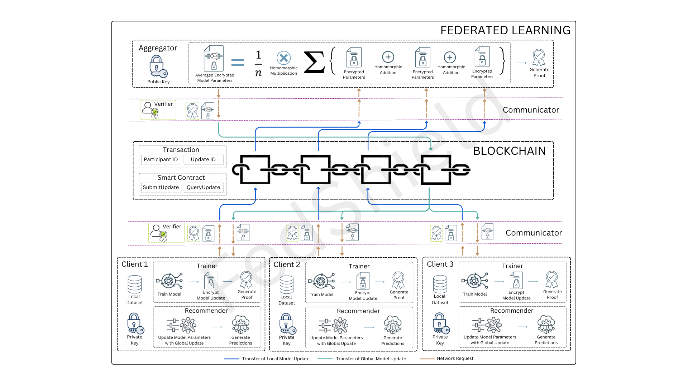

# FedShield: Privacy Preservation for Blockchain Enabled Federated Learning with Homomorphic Encryption and Zero-Knowledge Proof  
Authors: [Pallavi Arora](https://github.com/arorapallavi), [Arya Tapikar](https://github.com/aryatapikar), [Akshat Aryan](https://github.com/crazydj8), [Amogh Manish V](https://github.com/Drakonxd786) & Sarasvathi V\
Published in: [Proceedings of 17th International Conference on Machine Learning and Computing](https://doi.org/10.1007/978-3-031-94898-5)\
DOI: [10.1007/978-3-031-94898-5_44](https://doi.org/10.1007/978-3-031-94898-5_44)\
Springer Link: [Read the paper here](https://link.springer.com/chapter/10.1007/978-3-031-94898-5_44)

---

## Abstract
The increasing reliance on datasets in machine learning raises concerns about user privacy and data security. Federated Learning (FL) addresses this by client-side model training through contribution of model updates rather than raw data, enabling data ownership. Vulnerability of centralization risks, inference attacks and free-rider attacks persists necessitating the need for advanced security solutions. This paper proposes FedShield, a novel approach that integrates FL with Blockchain, Homomorphic Encryption (HE) and Zero-Knowledge Proof (ZKP). FedShield utilizes Blockchain for a transparent ledger, HE for computations on encrypted data eliminating need for decryption, and ZKP for verifying model updates while maintaining confidentiality. Clients train local models on their datasets, and encrypt the updates which are verified before storage. Encrypted local model updates are homomorphically averaged to generate an aggregated global model update, which boosts local model generalization and recommendation. FedShield achieves over 90% accuracy in a video recommender system while ensuring privacy preservation.



## Dependencies:

* Python >3.8
* Python Torch, scikit-learn, pandas, numpy, requests, tenseal, ezkl, onnx, sentence-transformers modules.\
can be installed by running:\
    ```pip install -r requirements.txt```
* Docker (Any latest version)
* go (Any latest version)

## Setup steps:

1) make the following file executable:
    ```
    $ chmod +x ./gen_HE_context.py
    ```

2) create a file called ".env"
    ```
    COUCHDB_USERNAME = yourcouchdbusername
    COUCHDB_PASSWORD = yourcouchdbpassword
    ```

3) Place the above .env file in the directory:\
    ./communicator

## Steps to Run Project (to be done in order)
1) First open 1 terminal window:
    ```
    $ cd fabric
    $ source ./initializefabric.sh
    ```

2) Now open 2nd terminal window:
    ```
    $ cd communicator
    $ go run main.go
    ```

3) Now Open a 3rd terminal window:
    ```
    $ cd verifier
    $ python3 main.py
    ```

4) Now open a 4th terminal window with 3 separate tabs:

    on each terminal: 
    ```
    # cd into each client folder in each tab
    $ cd clients/clientx # x = 1, 2, 3
    $ python3 trainer.py
    ```
5) Open another terminal in aggegator folder:
    ```
    $ cd aggregator
    $ python3 main.py
    ```
6) Go back to the 3 client terminals and enter:
    ```
    $ cd clients/clientx # x = 1, 2, 3
    $ python3 main.py
    ```

after initializing the fabric, 
* one can view the CouchDB interface on ```http://localhost/5984/_utils```
* one can view the ledger by using **peer query** commands on the CLI


## Citation
If you use this code, please cite our paper:\
```Arora, P., Tapikar, A., Aryan, A., Manish, V.A., Sarasvathi, V. (2025). FedShield: Privacy Preservation for Blockchain Enabled Federated Learning with Homomorphic Encryption and Zero-Knowledge Proof. In: Huang, L., Greenhalgh, D. (eds) Proceedings of 17th International Conference on Machine Learning and Computing. ICMLC 2025. Lecture Notes in Networks and Systems, vol 1476. Springer, Cham. https://doi.org/10.1007/978-3-031-94898-5_44```
